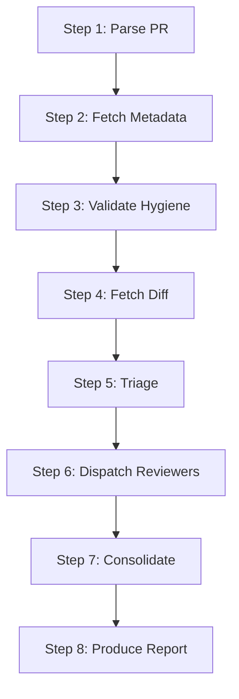

# Code Review

Orchestrate a multi-reviewer PR analysis by gathering context, dispatching focused subagents in parallel, and consolidating findings into a single report.

## Prerequisites

- `gh` CLI installed and authenticated (`gh auth status`)
- Reviewer subagents installed in `~/.cursor/agents/`:
  - `review-architecture`
  - `review-react-typescript`
  - `review-security`
  - `review-performance`
  - `review-testing`

## Companion Files

```
code-review/
├── SKILL.md              ← You are here (orchestrator)
└── findings-format.md    ← Severity, confidence, and consolidation rules
```

Reviewer subagents live in `~/.cursor/agents/review-*.md` and reference files in `~/.cursor/references/` and `~/.cursor/review-projects/<repo>/`.

## Workflow



---

### Step 1: Parse the PR

Extract `owner`, `repo`, and PR `number` from the input.

- If given a URL like `https://github.com/<owner>/<repo>/pull/123`, parse directly.
- If no URL provided, detect from the current branch: `gh pr view --json number,url`.
- If no PR exists for the current branch, inform the user.

Record the repo name for project-specific reference loading in Step 5.

### Step 2: Fetch PR metadata

```bash
gh pr view <number> --repo <owner/repo> --json title,body,author,files,additions,deletions,baseRefName,headRefName,reviews,comments,labels,isDraft
```

### Step 3: Validate PR hygiene

Check that the PR has a descriptive title and a body with meaningful content.

Size check:
- **OK**: additions + deletions <= 500 lines
- **Warning**: additions + deletions > 500 lines
- **Recommend split**: additions + deletions > 1500 lines

### Step 4: Fetch the diff

```bash
gh pr diff <number> --repo <owner/repo>
```

Read changed files in full when needed for context.

### Step 5: Triage

Classify the changed files and determine which reviewers to dispatch.

**File classification:**

| Category | Extensions / Patterns |
|----------|-----------------------|
| Source (TS/React) | `.ts`, `.tsx` |
| Source (other) | `.js`, `.jsx`, `.rb`, `.go`, `.py` |
| Test | `*.test.*`, `*.spec.*`, `__tests__/*` |
| Locale | `*.json` in `locales/` |
| Config | `*.config.*`, `*.yaml`, `*.yml`, `*.json` (non-locale) |
| Docs | `*.md`, `*.mdx` |
| Style | `*.css`, `*.scss`, `*.styled.*` |

**Dispatch matrix:**

| Reviewer | Dispatch when | Context to send |
|----------|--------------|-----------------|
| `review-architecture` | Always (any code change) | Full diff |
| `review-react-typescript` | Source (TS/React) or Locale files in diff | TS/TSX/JSON files only |
| `review-security` | Always (any code change) | Full diff |
| `review-performance` | Source files in diff (skip if docs/config only) | Source files only |
| `review-testing` | Always (any code change) | Test files + corresponding source files |

If the PR is docs-only or config-only (no source or test files), dispatch only `review-architecture` and `review-security` with a note that the PR contains no source code changes.

### Step 6: Dispatch reviewers

Dispatch the selected reviewer subagents in parallel. For each reviewer, include in the prompt:

1. **PR context**: title, author, PR size
2. **The diff** (filtered per the context routing in Step 5)
3. **The repo name** so the reviewer can load project-specific reference files
4. **Instruction**: "Return findings in the standard format defined in your prompt."

Dispatch all applicable reviewers simultaneously. Do not wait for one to finish before starting the next.

If a reviewer returns an error or empty result, log the gap and continue. Do not retry -- note the missing coverage in the final report.

### Step 7: Consolidate

Read `findings-format.md` for consolidation rules. Apply them:

1. **Collect** all findings from all reviewers.
2. **Deduplicate**: If two reviewers flag the same file:line, keep the higher-severity finding and note both reviewers (e.g., `[Architecture, Security]`).
3. **Rank**: Sort by severity -- Critical first, then Improvement, then Nitpick.
4. **Attribute**: Tag each finding with its reviewer (e.g., `[Architecture]`, `[Security]`).
5. **Merge praise**: Combine all praise entries into the Strengths section.
6. **Synthesize summaries**: Combine reviewer summaries into a cohesive overall Summary.

### Step 8: Produce report

Use the output format below. Include all findings from Step 7.

---

## Feedback Guidelines

**Tone:**

- Be constructive, professional, and friendly.
- Explain _why_ a change is requested -- don't just say "fix this."
- For approvals, acknowledge the specific value of the contribution.

---

## Output Format

```markdown
---

## Code Review: <PR title>

**Reviewers dispatched:** [list which ran, note any skipped/failed]

---

### PR Hygiene

| Check          | Result           |
|----------------|------------------|
| Title format   | pass / fail      |
| Body sections  | pass / fail      |
| Size           | N+ / N- (ok / warning) |

---

### Summary

[High-level overview synthesized from all reviewer summaries: what this PR does, overall impression, key observations.]

---

### Findings

#### [!] Critical

- `[Reviewer]` **file:line** -- [Description]. **Why**: [Impact]. **Suggestion**: [Fix].

#### [~] Improvements

- `[Reviewer]` **file:line** -- [Description]. **Why**: [Impact]. **Suggestion**: [Fix].

#### [-] Nitpicks

- `[Reviewer]` **file:line** -- [Description]. **Suggestion**: [Fix].

---

### Strengths

[Consolidated praise from all reviewers. Be genuine.]

---

### Conclusion

> **Recommendation:** Approved | Approved with suggestions | Request Changes
>
> [1-2 sentence rationale.]

---
```
